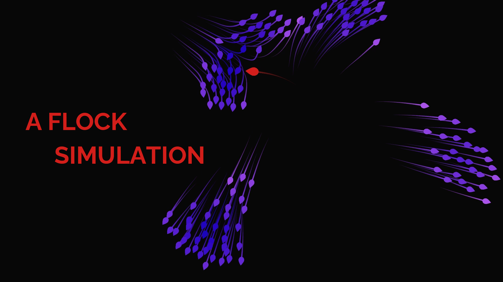

# Boids
In 1986 Craig Reynolds created an artificial life simulation called Boids, which
was able to closely imitate the behavior of flocks of birds. This is an implementation
of the Boids Algorithm made in Godot (v3.2.3).

## Getting Started
### Prerequisites

You only need [Godot v3.2.3](https://godotengine.org/download) or a higher version.

### Installing

Clone or download this repository and

## Guide of use

This algorithm is an example of an emergent behavior. This means that the
behavior itself is not programmed by us, and rather shows up as a product of
the interaction of smaller parts. So, we only have to code a set of rules
every bird-oid object (*boid*) must follow, and then put them all together.

The main rules are cohesion, separation and alignment. You can find a more
in-depth explanation in [this video](youtube.com) I made.

You can find 2 main scripts in the Godot project:

- **Flock**. This is responsible for spawning the flock and then making the
necessary calculations for each rule. This is done this way, instead of
each boid deciding by itself, to allow for a more efficient and manageable code,
since the flock script has access to all the boids.

- **Boid**. This script acts as a container that can be accessed from the flock
script. It's also responsible for updating the boid's position, rotation and
velocity using the acceleration set by the flock's script.

## Built With

* [Godot v3.2.3](https://godotengine.org/)

## Contributing

Please read [_doc/CONTRIBUTING.md](CONTRIBUTING.md) for details on our code of conduct, and the process for submitting pull requests to us.

## Authors

* **[Sergio Abreu García](https://sergioabreu.me)** - *Structure modifications*

See also the list of [contributors](https://github.com/your/project/contributors) who participated in this project.

## License

This project is licensed under the Apache 2.0 License - see the [LICENSE](LICENSE) file for details.

## Acknowledgments

* [Craig Reynolds](https://www.red3d.com/cwr/boids/)
* [Bean Eater](https://eater.net/boids)
